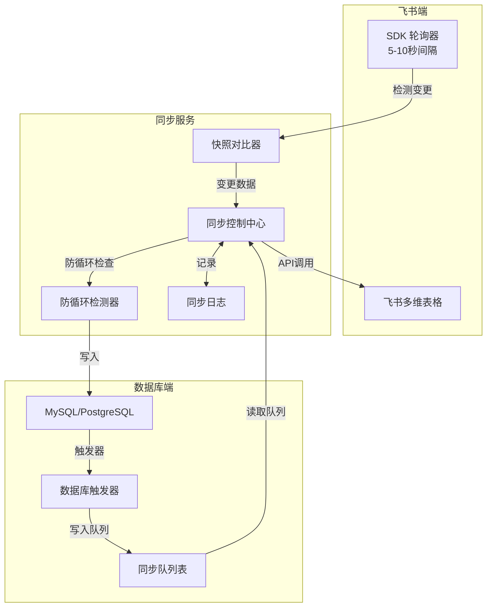
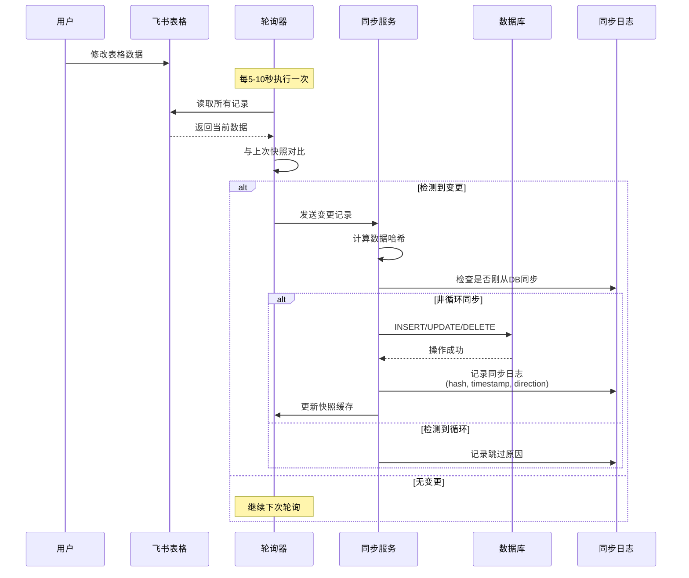
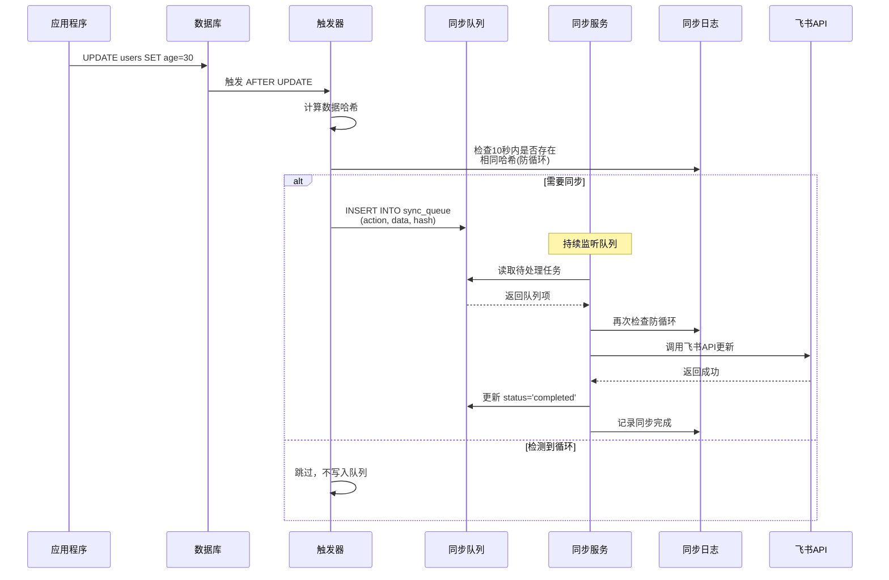
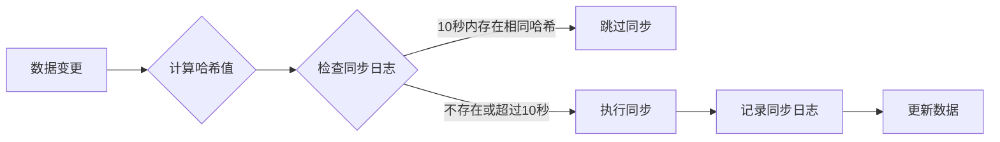
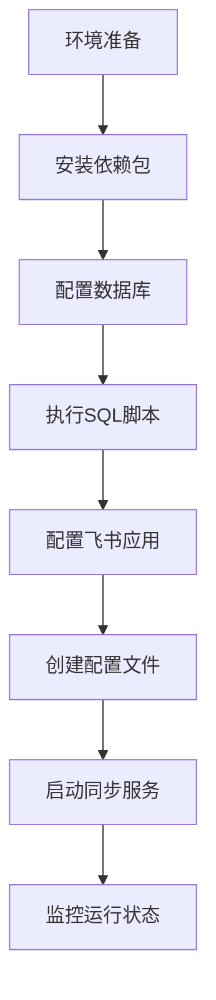

# 飞书表格与云端数据库双向实时同步解决方案

## 概述

本方案实现了飞书多维表格与云端数据库的双向准实时同步。通过轮询检测 + 数据库触发器的混合策略，在飞书 API 限制下实现了最佳的同步效果。

## 技术架构



## 核心同步流程

### 1. 飞书表格 → 数据库同步



### 2. 数据库 → 飞书表格同步



## 防循环同步机制



### 防循环核心逻辑

1. **数据哈希计算**：对数据内容（排除系统字段）计算 MD5
2. **时间窗口检测**：10秒内相同哈希值视为循环同步
3. **方向标记**：记录同步方向（feishu_to_db 或 db_to_feishu）

## 关键组件实现

### 1. 轮询检测器（飞书端）

```python
class FeishuChangeDetector:
    def detect_changes(self, database: str, table: str):
        # 1. 获取当前所有记录
        current_records = feishu_api.read_all_records()
        
        # 2. 从缓存获取上次快照
        last_snapshot = cache.get(f"{database}:{table}")
        
        # 3. 对比检测变更
        changes = []
        for record in current_records:
            if last_snapshot.get(record.id) != hash(record):
                changes.append(record)
        
        # 4. 更新快照
        cache.set(f"{database}:{table}", current_snapshot)
        
        return changes
```

### 2. 数据库触发器

```sql
CREATE TRIGGER after_update
AFTER UPDATE ON users
FOR EACH ROW
BEGIN
    -- 计算数据哈希
    SET @hash = MD5(CONCAT(NEW.name, NEW.age, NEW.email));
    
    -- 检查是否需要同步（防循环）
    IF NOT EXISTS (
        SELECT 1 FROM sync_log 
        WHERE sync_hash = @hash 
        AND created_at > DATE_SUB(NOW(), INTERVAL 10 SECOND)
    ) THEN
        -- 写入同步队列
        INSERT INTO sync_queue (
            table_name, action, record_id, 
            new_data, sync_hash
        ) VALUES (
            'users', 'UPDATE', NEW.id,
            JSON_OBJECT('name', NEW.name, 'age', NEW.age),
            @hash
        );
    END IF;
END;
```

### 3. 同步服务核心

```python
class RealtimeSyncService:
    def __init__(self):
        self.poll_interval = 5  # 5秒轮询一次
        self.snapshots = {}     # 内存快照缓存
        
    def sync_loop(self):
        while True:
            # 1. 飞书到数据库同步
            self.sync_feishu_to_db()
            
            # 2. 处理数据库同步队列
            self.process_db_sync_queue()
            
            time.sleep(self.poll_interval)
```

## 数据结构设计

### 同步队列表

```sql
CREATE TABLE sync_queue (
    id BIGINT PRIMARY KEY AUTO_INCREMENT,
    table_name VARCHAR(100),
    record_id VARCHAR(100),
    action VARCHAR(20),      -- INSERT/UPDATE/DELETE
    old_data JSON,
    new_data JSON,
    sync_hash VARCHAR(64),   -- 数据哈希值
    status VARCHAR(20) DEFAULT 'pending',
    retry_count INT DEFAULT 0,
    created_at TIMESTAMP DEFAULT CURRENT_TIMESTAMP,
    processed_at TIMESTAMP NULL
);
```

### 同步日志表

```sql
CREATE TABLE sync_log (
    id BIGINT PRIMARY KEY AUTO_INCREMENT,
    table_name VARCHAR(100),
    record_id VARCHAR(100),
    direction VARCHAR(50),   -- feishu_to_db 或 db_to_feishu
    sync_hash VARCHAR(64),   -- 用于防循环检测
    status VARCHAR(20),
    created_at TIMESTAMP DEFAULT CURRENT_TIMESTAMP,
    INDEX idx_hash_time (sync_hash, created_at)
);
```

## 部署流程



### 快速启动

```bash
# 1. 安装依赖
pip install feishu-bitable-db pymysql loguru

# 2. 初始化数据库
mysql -u root -p < database_triggers.sql

# 3. 配置服务
cp config.example.json config.json
# 编辑 config.json 填入你的配置

# 4. 启动服务
python sync_service.py
```

## 性能指标

| 指标 | 数值 | 说明 |
|------|------|------|
| 同步延迟 | 5-10秒 | 飞书到数据库的最大延迟 |
| 数据库到飞书 | <1秒 | 触发器即时响应 |
| 吞吐量 | 1000条/分钟 | 单进程处理能力 |
| CPU占用 | <5% | 轮询模式下的资源消耗 |
| 内存占用 | <100MB | 快照缓存占用 |

## 监控告警

### 关键监控指标

```sql
-- 队列积压情况
SELECT COUNT(*) as pending_count 
FROM sync_queue 
WHERE status = 'pending';

-- 同步成功率
SELECT 
    DATE(created_at) as date,
    COUNT(CASE WHEN status='completed' THEN 1 END) / COUNT(*) as success_rate
FROM sync_queue
GROUP BY DATE(created_at);

-- 平均同步延迟
SELECT AVG(TIMESTAMPDIFF(SECOND, created_at, processed_at)) as avg_delay
FROM sync_queue
WHERE status = 'completed'
AND created_at > DATE_SUB(NOW(), INTERVAL 1 HOUR);
```

### 告警阈值

- 队列积压 > 1000 条
- 成功率 < 90%
- 平均延迟 > 30 秒

## 故障处理

### 1. 数据不一致

```python
# 数据一致性检查脚本
def check_consistency():
    for table in tables:
        feishu_count = get_feishu_record_count(table)
        db_count = get_db_record_count(table)
        
        if abs(feishu_count - db_count) > threshold:
            trigger_full_sync(table)
```

### 2. 同步循环

```sql
-- 检测同步循环
SELECT record_id, COUNT(*) as sync_count
FROM sync_log
WHERE created_at > DATE_SUB(NOW(), INTERVAL 10 MINUTE)
GROUP BY record_id
HAVING sync_count > 20;
```

## 限制和注意事项

1. **API 限制**
   - 飞书 API 有频率限制，轮询间隔不应小于 5 秒
   - 建议使用批量 API 减少请求次数

2. **数据类型映射**
   - 飞书的人员、附件等特殊字段需要特殊处理
   - 时间字段注意时区转换

3. **事务一致性**
   - 本方案是最终一致性，不保证强一致性
   - 关键业务建议增加数据校验

4. **扩展性**
   - 大数据量场景建议分表分库
   - 可以部署多个同步服务实例

## 优化建议

1. **使用 Redis 缓存**减少数据库查询
2. **批量处理**提高同步效率
3. **增量同步**减少数据传输量
4. **并行处理**多表同时同步

## 总结

本方案通过轮询 + 触发器的混合策略，在飞书 API 的限制下实现了最佳的双向同步效果。虽然不是真正的实时（有 5-10 秒延迟），但已经能满足大部分业务场景的需求。通过完善的防循环机制和错误处理，保证了系统的稳定性和可靠性。